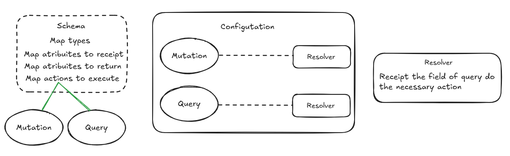

## GraphQL with java

Java project with spring using graphQL to comunication

This project was developed to study implementation with and without spring.
So in the "manual" package you can see how graphQL works without spring annotations.



## Querys
````query movie{
  movieById(id: 1){
    id
    name
    actors{
      id
      name
      dateOfBirth
    }
    releasedDate
    gender
  }
}

query actor{
  actorById(id: 1){
    name
    dateOfBirth
  }
}

query findAll{
  findAllMovies{
    id
    name
    actors{
      id
      name
      dateOfBirth
    }
    releasedDate
    gender
  }
}

mutation CreateMovie{
  createMovie(name: "Teste", actorIds:[1,2,3],releasedDate: "2024-10-04", gender:COMEDY) {
    id
    name
    actors{
      id
      name
    }
    releasedDate
    gender
  }
}

mutation updateMovie{
  updateMovie(movie: {id: 2, name: "Teste2"}) {
    id
    name
    actors{
      id
      name
    }
    releasedDate
    gender
  }
}

mutation deleteMovie{
  deleteMovie(id:1){
    name
  }
}````